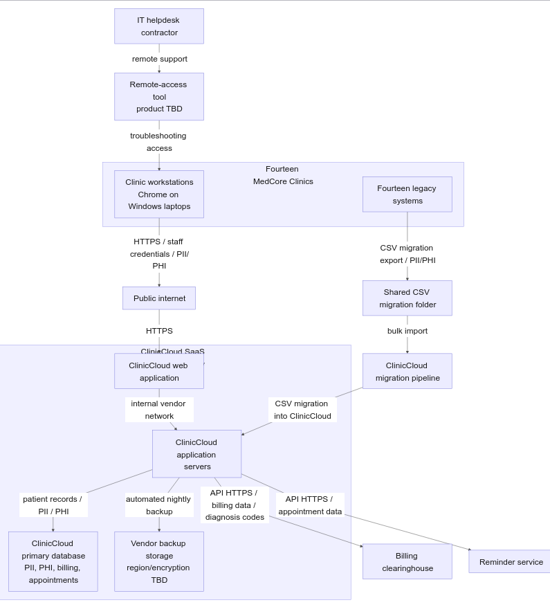
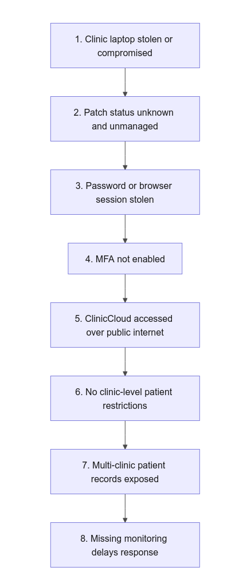
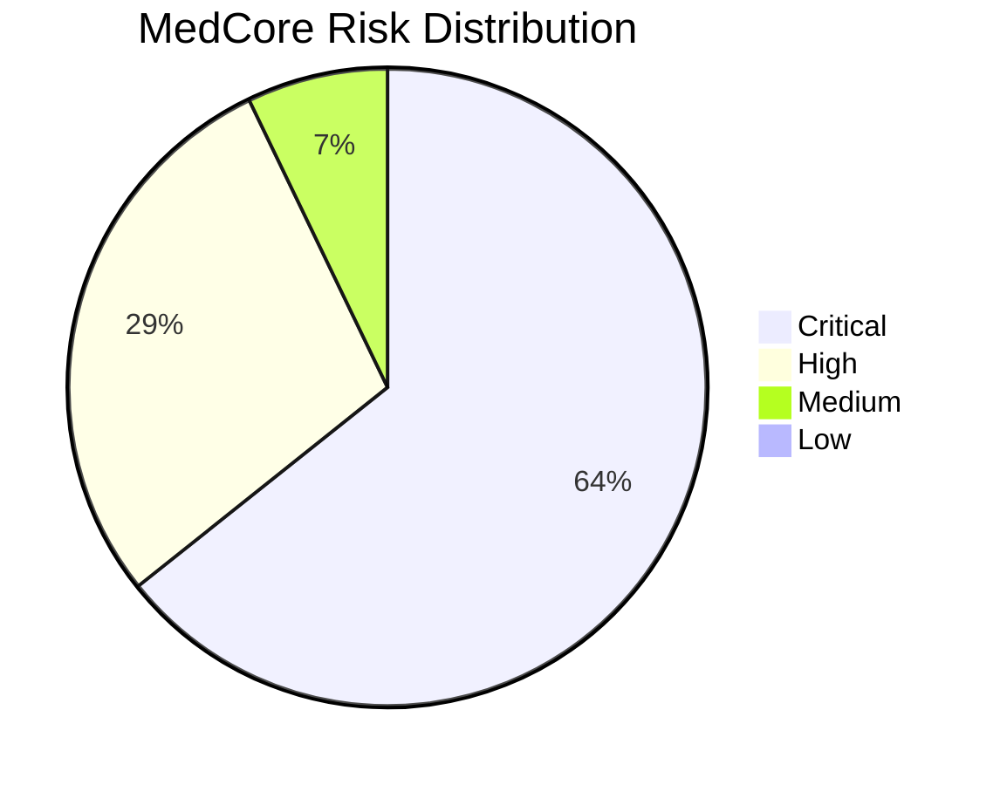

# MedCore Clinics GRC Risk Assessment Report

## Cover Information

| Field | Value                                     |
| --- |-------------------------------------------|
| Organization | MedCore Clinics                           |
| Document | GRC Risk Assessment Report                |
| Framework | NIST Cybersecurity Framework 2.0          |
| Assessment phase | Design / Pre-Implementation               |
| Prepared by | Hassan Ayman                              |
| Student ID | 01033051217                               |
| Course | Cyber                                     |
| Instructor | Mohamed Sherif, Ahmed Hesham, Saleh Gomaa |
| Submission date | August 31, 2026                           |
| Document version | 1.0                                       |

## Document Control

| Item | Value                                      |
| --- |--------------------------------------------|
| Document title | MedCore Clinics GRC Risk Assessment Report |
| Version | 1.0                                        |
| Status | Final academic submission                  |
| Author | Hassan Ayman                               |
| Date | August 31, 2026                            |
| Classification | Academic / Confidential Scenario           |

## Table of Contents

1. [Executive Summary](#1-executive-summary)
2. [Scope, Methodology, and Assumptions](#2-scope-methodology-and-assumptions)
3. [Architecture and Data Flow](#3-architecture-and-data-flow)
4. [Asset Inventory](#4-asset-inventory)
5. [Framework Selection](#5-framework-selection)
6. [NIST CSF 2.0 Gap Analysis](#6-nist-csf-20-gap-analysis)
7. [Threat Model and Attack Chain](#7-threat-model-and-attack-chain)
8. [Qualitative Risk Register](#8-qualitative-risk-register)
9. [Business Impact Analysis](#9-business-impact-analysis)
10. [Prioritized Remediation Roadmap](#10-prioritized-remediation-roadmap)
11. [Auditor Review and Consistency Statement](#11-auditor-review-and-consistency-statement)
12. [Conclusion](#12-conclusion)
13. [References](#references)
14. [Appendices](#appendices)

## 1. Executive Summary

MedCore Clinics requested this design-phase cybersecurity governance, risk, and compliance assessment before implementing and migrating patient data into ClinicCloud, a cloud-hosted Electronic Health Record SaaS platform. The assessment was performed because MedCore is moving from 14 separate local practice-management systems to one shared cloud platform while it has no established security function, no security policy, no formal access-control process, and no prior risk assessment on file (MedCore Resource Pack, Section 2). The environment assessed includes the 14 outpatient clinics, existing Windows clinic laptops, browser access to ClinicCloud over the public internet, the ClinicCloud web application and database, migration files and the migration pipeline, backup storage, the billing-clearinghouse integration, the reminder-service integration, and the IT helpdesk contractor remote-support model (MedCore Resource Pack, Sections 3.1 and 3.2).

This report uses the NIST Cybersecurity Framework 2.0 because MedCore needs a practical, risk-based framework that covers governance, asset identification, protective safeguards, monitoring, incident response, and recovery. NIST CSF 2.0 is suitable for a healthcare-style environment that processes regulated patient information and depends on cloud SaaS and external vendors without assuming that MedCore already operates a mature security management system.

The overall risk posture is not production-ready. The design contains several high-impact weaknesses that affect patient confidentiality, regulated data handling, operational continuity, and incident response. The most serious issues are not theoretical. They arise directly from the design: ClinicCloud authentication is password-only because MFA is available but not enabled; clinicians can currently see patients from other clinic locations; legacy records will be exported to CSV files and uploaded through a shared migration folder; existing clinic laptops have unknown and unmanaged patch status; MedCore has no designed access to relevant audit logs or security monitoring; no incident-response or breach-notification procedure exists; and no vendor risk assessment or contract security addendum has been completed for ClinicCloud, the billing clearinghouse, or the reminder service (MedCore Resource Pack, Sections 3.1, 3.4, and 3.5).

The top risks are password-only ClinicCloud account takeover (`R-01`, score 20, Critical), excessive cross-clinic patient access (`R-02`, score 20, Critical), legacy CSV migration-file exposure (`R-03`, score 20, Critical), compromise through unmanaged or unpatched clinic laptops (`R-04`, score 16, Critical), and contractor remote-access compromise (`R-05`, score 16, Critical). These risks are launch blockers because they affect patient records, regulated data obligations, clinical operations, or MedCore's ability to detect and respond to an incident.

The major regulatory concerns are minimum-necessary access, audit trails, breach notification, and third-party handling of patient information. The resource pack directs the assessment to treat MedCore's jurisdiction as broadly equivalent to HIPAA-style obligations, including breach notification duties, minimum-necessary access, and audit-trail requirements for patient data (MedCore Resource Pack, Section 2). The current design does not yet provide clinic-level patient-access restrictions, documented audit-log access for MedCore, or a breach-notification procedure.

MedCore should not proceed to production in the current design. Conditional go-live approval should be granted only after all before-go-live remediation actions have been implemented and verified.

The single most important recommendation is: Require multi-factor authentication and enforce least-privilege, clinic-level access before any production patient data is migrated.

## 2. Scope, Methodology, and Assumptions

### 2.1 Assessment Purpose

This assessment was conducted during the design / pre-implementation phase before ClinicCloud implementation and patient-record migration. Its purpose is to identify MedCore's material cybersecurity and compliance risks, map design gaps to NIST CSF 2.0, and recommend prioritized remediation before production patient data is migrated.

The kickoff document identifies MedCore Clinics as the GRC track scenario for protecting patient data and requires a framework-mapped, scored risk matrix with at least 12 risks and a class presentation (Capstone Kickoff, Project 1: MedCore Clinics).

### 2.2 Scope

The following are in scope:

- Fourteen MedCore outpatient clinics across three cities (MedCore Resource Pack, Section 2).
- Clinic workstations and existing clinic-owned Windows laptops used to access ClinicCloud (MedCore Resource Pack, Section 3.1).
- The ClinicCloud SaaS platform, including the web application, application servers, tenant environment, and primary database (MedCore Resource Pack, Sections 3.1 and 3.2).
- The ClinicCloud identity system that stores and manages staff usernames and passwords (MedCore Resource Pack, Sections 3.1 and 3.3).
- Patient, clinical, billing, appointment, staff credential, and legacy CSV data (MedCore Resource Pack, Section 3.3).
- Legacy migration files, the vendor-provided shared migration folder, and the migration pipeline (MedCore Resource Pack, Sections 3.1, 3.2, and 3.5).
- Vendor backup storage and the planned nightly backup flow (MedCore Resource Pack, Sections 3.2, 3.4, and 3.5).
- Billing-clearinghouse and reminder-service integrations (MedCore Resource Pack, Section 3.2).
- IT helpdesk contractor access and the planned remote-access capability (MedCore Resource Pack, Sections 2, 3.2, and 3.5).
- Relevant clinical, scheduling, billing, migration, access-management, incident-response, and recovery processes.

### 2.3 Out of Scope

The following items are out of scope:

- Technical penetration testing.
- Vulnerability scanning.
- Production configuration validation.
- Source-code review.
- Physical security testing.
- Financial-loss modeling, Annualized Loss Expectancy, and Single Loss Expectancy calculations.
- Formal legal opinion or regulatory certification.
- Independent verification of vendor infrastructure controls.

The system has not yet been implemented; this report assesses the design documentation and documented control intent.

### 2.4 Methodology

The assessment followed these steps:

1. Design-document review of the kickoff scenario and MedCore resource pack.
2. Asset identification from the architecture, data-flow, and data-classification sections.
3. NIST CSF 2.0 gap analysis using current design evidence.
4. Threat modeling based on MedCore's identities, endpoints, data flows, integrations, migration process, and vendor dependencies.
5. Qualitative risk assessment using the required 5x5 likelihood-impact matrix.
6. Business Impact Analysis for six critical processes or systems.
7. Remediation prioritization across before-go-live, first-90-day, and longer-term horizons.
8. Internal traceability review across assets, gaps, risks, BIA dependencies, roadmap items, and policy statements.

### 2.5 Risk-Scoring Method

Risk score is calculated as:

`Risk Score = Likelihood x Impact`

| Score | Likelihood Rating | Design-Phase Meaning |
| ---: | --- | --- |
| 1 | Rare | Requires multiple unusual or independent failures, with no realistic path in the design |
| 2 | Unlikely | Possible, but an existing mitigating factor makes occurrence uncommon |
| 3 | Possible | Plausible based on the documented design and common industry experience |
| 4 | Likely | The design contains a clear exploitable gap that is expected to cause exposure without intervention |
| 5 | Almost Certain | The design contains no meaningful protection and occurrence is nearly guaranteed under normal conditions |

| Score | Impact Rating | Design-Phase Meaning |
| ---: | --- | --- |
| 1 | Negligible | No material operational, data, safety, or compliance effect |
| 2 | Minor | Localized and short-lived disruption without sensitive-data or safety exposure |
| 3 | Moderate | Noticeable disruption or limited data exposure recoverable through normal operations |
| 4 | Major | Significant disruption or sensitive-data breach, with likely regulatory attention |
| 5 | Severe | Extended outage, major regulated-data breach, safety incident, or existential regulatory consequence |

| Score | Level |
| ---: | --- |
| 1-4 | Low |
| 5-9 | Medium |
| 10-15 | High |
| 16-25 | Critical |

These scales are the required project scoring method (MedCore Resource Pack, Section 4.4).

### 2.6 Limitations

- The assessment relies on the supplied design documentation.
- No technical implementation exists to test.
- Vendor statements, including TLS, encryption, and ISO 27001 claims, have not necessarily been independently verified.
- Missing documentation is treated as a design control gap, not proof that a control can never exist.
- The assessment is not a legal opinion, HIPAA certification, NIST certification, or production audit.

### 2.7 Assumptions

| Assumption ID | Assumption | Reason | Effect on the Assessment |
| --- | --- | --- | --- |
| AS-01 | MedCore remains accountable for patient data processed by ClinicCloud, the clearinghouse, the reminder service, and the helpdesk contractor. | The resource pack identifies MedCore as a healthcare organization processing regulated patient information and relying on third parties (MedCore Resource Pack, Section 2). | Third-party failures are treated as MedCore regulatory and operational risks, not only vendor issues. |
| AS-02 | Clinic laptops lack centralized patch management because centralized patching is not documented and patch status is stated as unknown/unmanaged. | The design states that existing clinic-owned Windows laptops are about four years old with unknown/unmanaged patch status (MedCore Resource Pack, Section 3.1). | Endpoint compromise likelihood is rated higher until patch and configuration management are verified. |
| AS-03 | ClinicCloud may generate audit logs, but MedCore lacks documented access to them. | The design says audit logs, if any, exist only inside the vendor platform and MedCore has not asked for access (MedCore Resource Pack, Section 3.4). | Missing MedCore-side monitoring and audit evidence is treated as a control gap. |
| AS-04 | No tested recovery process exists because backup restoration testing, RTO, and RPO are not documented. | The design states nightly backup is planned, but backup region and encryption are unspecified; no RTO, RPO, or test evidence is documented (MedCore Resource Pack, Sections 3.2, 3.4, and 3.5). | Recovery risk remains high until backup and restoration controls are verified. |
| AS-05 | All clinics will depend on ClinicCloud after migration. | The business context states leadership approved migration of all patient records to a single cloud EHR so any clinic can access patient history and central scheduling can occur (MedCore Resource Pack, Section 2). | ClinicCloud outage risk is treated as cross-clinic operational risk. |
| AS-06 | ClinicCloud access depends on public internet connectivity. | The access model states each clinic accesses ClinicCloud through a browser over the public internet with no VPN or dedicated link currently planned (MedCore Resource Pack, Section 3.1). | Availability and access risks include clinic internet and SaaS connectivity dependencies. |
| AS-07 | Owners not explicitly assigned in the source are inferred from stated stakeholder responsibilities. | The source names stakeholders but does not assign owners for every asset or process (MedCore Resource Pack, Section 2). | Inferred ownership is labeled in the asset inventory and roadmap. |
| AS-08 | The Access Control Policy is recommended for adoption before production use; it is not documented as already approved or implemented. | The source says no security policy and no formal access-control process currently exist (MedCore Resource Pack, Section 2). | Policy controls are recommendations and required conditions, not current-state controls. |

## 3. Architecture and Data Flow

### 3.1 System Overview

MedCore Clinics operates 14 outpatient clinics across three cities and plans to migrate from locally installed practice-management systems with paper backups to one cloud-based EHR platform named ClinicCloud (MedCore Resource Pack, Section 2). ClinicCloud is a multi-tenant, cloud-hosted SaaS product operated by a third-party vendor, with MedCore as one tenant on shared infrastructure (MedCore Resource Pack, Section 3.1).

Each clinic will access ClinicCloud through a Chrome browser on existing clinic-owned Windows laptops over the public internet; no VPN or dedicated link is currently planned (MedCore Resource Pack, Section 3.1). Authentication is a single username and password per staff member, stored and managed by the SaaS vendor. MFA is available as a vendor add-on but has not been enabled in the design (MedCore Resource Pack, Section 3.1).

The current role model defines only two roles: Clinician and Front Desk. The design does not distinguish between clinic locations, meaning a clinician at any clinic can currently see patients from any other clinic (MedCore Resource Pack, Section 3.1). ClinicCloud application servers store and process patient records, PII/PHI, billing, and appointment data in the primary database and integrate with a third-party billing clearinghouse and SMS/email appointment reminder service (MedCore Resource Pack, Sections 3.2 and 3.3).

Legacy records from the 14 local systems will be exported to CSV, uploaded over HTTPS to a vendor-provided shared folder, and bulk-imported by the vendor's migration team through the migration pipeline (MedCore Resource Pack, Sections 3.1 and 3.2). ClinicCloud application servers will perform automated nightly backups to vendor backup storage, but the region and encryption status are not specified in the design (MedCore Resource Pack, Sections 3.2 and 3.5). The IT helpdesk contractor will use a remote-access tool to troubleshoot clinic workstations, but the product is still to be determined (MedCore Resource Pack, Sections 2, 3.2, and 3.5).

### 3.2 Data-Flow Diagram

### 3.3 Trust Boundaries

| Boundary | Description | Why It Matters |
| --- | --- | --- |
| Clinic endpoint boundary | Existing Windows laptops in 14 clinics access ClinicCloud through Chrome (MedCore Resource Pack, Section 3.1). | Unknown patch status and unmanaged devices create a credential, session, malware, and ransomware exposure point. |
| Public internet boundary | Clinic workstations connect to the SaaS web application over the public internet without a planned VPN or dedicated link (MedCore Resource Pack, Section 3.1). | Internet-exposed authentication makes MFA, secure sessions, and monitoring critical. |
| ClinicCloud vendor boundary | ClinicCloud is a multi-tenant SaaS platform operated by a third-party vendor (MedCore Resource Pack, Section 3.1). | MedCore depends on vendor controls, contractual commitments, logs, encryption, backup, and tenant isolation. |
| External billing-vendor boundary | ClinicCloud sends patient demographic and diagnosis-code claim data to the billing clearinghouse over API HTTPS (MedCore Resource Pack, Section 3.2). | Billing data contains sensitive and regulated patient information handled by a third party. |
| Reminder-service boundary | ClinicCloud sends patient contact information and appointment time to a third-party reminder service (MedCore Resource Pack, Sections 3.2 and 3.3). | Even limited reminder data can expose patient privacy and requires vendor controls. |
| Migration-folder boundary | Legacy CSV exports are uploaded to a vendor-provided shared folder and flagged as a retention/disposal open item (MedCore Resource Pack, Sections 3.2, 3.3, and 3.5). | Bulk legacy data in CSV files is highly concentrated and vulnerable if access, encryption, retention, or deletion is weak. |
| Helpdesk-contractor boundary | The IT helpdesk contractor will remotely access clinic workstations using a product that has not yet been selected (MedCore Resource Pack, Sections 2, 3.2, and 3.5). | Contractor remote access can bypass normal controls unless the tool, authentication, session approval, logging, and termination are defined. |

### 3.4 Sensitive Data Flows

| Data Type | Created or Originating Source | Processed or Transmitted Through | Stored or Resides In | Source Citation |
| --- | --- | --- | --- | --- |
| Patient PII | Existing legacy practice-management systems and ClinicCloud patient records | Clinic workstations, ClinicCloud web app, application servers, billing clearinghouse, reminder service, CSV migration folder | ClinicCloud primary database, reminder service, clearinghouse, legacy CSV files | MedCore Resource Pack, Sections 3.2 and 3.3 |
| Patient PHI | Existing local systems and ClinicCloud clinical workflows | ClinicCloud application servers, primary database, migration pipeline, billing clearinghouse for diagnosis codes | ClinicCloud primary database and legacy CSV export files | MedCore Resource Pack, Sections 3.2 and 3.3 |
| Billing and insurance information | ClinicCloud billing workflows and legacy records | ClinicCloud application servers and third-party billing clearinghouse API | ClinicCloud primary database and clearinghouse | MedCore Resource Pack, Sections 3.2 and 3.3 |
| Appointment information | ClinicCloud scheduling workflows | ClinicCloud application servers and reminder service API | ClinicCloud primary database and reminder service | MedCore Resource Pack, Sections 3.2 and 3.3 |
| Staff credentials | ClinicCloud identity enrollment | Browser authentication over HTTPS to ClinicCloud | ClinicCloud vendor identity store | MedCore Resource Pack, Sections 3.1 and 3.3 |
| Legacy CSV exports | Fourteen legacy practice-management systems | Vendor-provided shared folder and migration pipeline | Shared migration folder pending import; target ClinicCloud primary database after import | MedCore Resource Pack, Sections 3.1, 3.2, 3.3, and 3.5 |

### 3.5 Key Exposure Points

- Password-only authentication is planned, while MFA is available but not enabled (MedCore Resource Pack, Sections 3.1 and 3.5).
- Cross-clinic patient visibility is currently permitted for clinician accounts because clinic-level segmentation is not designed (MedCore Resource Pack, Sections 3.1 and 3.5).
- Existing clinic-owned Windows laptops have unknown and unmanaged patch status (MedCore Resource Pack, Section 3.1).
- ClinicCloud access relies on browser access over the public internet without a planned VPN or dedicated link (MedCore Resource Pack, Section 3.1).
- Legacy CSV exports will be placed in a shared migration folder, and the data-retention/disposal policy has not been written (MedCore Resource Pack, Sections 3.1, 3.2, and 3.5).
- Encryption at rest is not specified beyond vendor sales language; algorithm, key ownership, and rotation are not documented (MedCore Resource Pack, Section 3.4).
- Backup storage encryption and region are unconfirmed (MedCore Resource Pack, Sections 3.2, 3.4, and 3.5).
- MedCore-side logging and monitoring are not designed, and MedCore has not asked for access to vendor audit logs (MedCore Resource Pack, Section 3.4).
- The remote-access tool for the helpdesk contractor is undefined (MedCore Resource Pack, Sections 3.2 and 3.5).
- Vendor risk assessments and contract security addenda have not been completed for ClinicCloud, the clearinghouse, or the reminder service (MedCore Resource Pack, Sections 3.4 and 3.5).

## 4. Asset Inventory

### 4.1 Asset Identification and Classification

| Asset ID | Asset Name | Type | Description | Classification or Criticality |
| --- | --- | --- | --- | --- |
| A-01 | Patient demographic information | Data | Patient name, DOB, address, and phone data used for clinical, billing, and reminder workflows. | Confidential PII |
| A-02 | Clinical notes and diagnosis codes | Data | Clinical notes and diagnosis codes stored in ClinicCloud and included in billing claims where applicable. | Restricted PHI |
| A-03 | Insurance and billing information | Data | Insurance and billing details used for claims and revenue-cycle processing. | Confidential |
| A-04 | Appointment schedule | Data / Process | Appointment dates and times used by clinics and the reminder service. | Internal |
| A-05 | Staff login credentials | Data / Identity | Staff usernames and passwords managed in the ClinicCloud vendor identity store. | Restricted |
| A-06 | Legacy CSV export files | Data | Exported records from the 14 legacy systems staged for migration. | Restricted |
| A-07 | ClinicCloud web application | Application | Browser-accessed SaaS EHR front end used by staff. | Mission-Critical |
| A-08 | ClinicCloud application servers | Infrastructure / Service | Vendor-hosted application tier that processes EHR workflows and integrations. | Mission-Critical |
| A-09 | ClinicCloud primary database | Data Store | Primary repository for patient records, PII/PHI, billing, and appointment data. | Restricted / Mission-Critical |
| A-10 | Vendor backup storage | Data Store / Service | Vendor-managed backup storage receiving automated nightly backups. | Mission-Critical |
| A-11 | Clinic workstations | Infrastructure | Existing clinic-owned Windows laptops using Chrome to access ClinicCloud. | Important |
| A-12 | Clinic internet connectivity | Infrastructure | Public internet connectivity used by clinics to reach ClinicCloud. | Important |
| A-13 | Legacy practice-management systems | Application | Local systems at the 14 clinics used before migration. | Important |
| A-14 | ClinicCloud migration pipeline | Process / Service | Vendor migration process that bulk-imports legacy CSV data into ClinicCloud. | Mission-Critical During Migration |
| A-15 | Shared CSV migration folder | Data Store / Service | Vendor-provided shared folder used to stage migration CSV files. | Restricted |
| A-16 | Third-party billing clearinghouse | Third Party / Integration | External claims processor receiving patient demographic and diagnosis-code data. | High Criticality |
| A-17 | SMS/email reminder service | Third Party / Integration | External service receiving patient name, phone/email, and appointment time. | Medium Criticality |
| A-18 | IT helpdesk contractor | Third Party | Four-person third-party helpdesk that will operate the new platform post-launch. | High Criticality |
| A-19 | Remote-access tool or process | Service / Access Channel | Product TBD for contractor troubleshooting access to clinic workstations. | High Criticality |

### 4.2 Asset Ownership and Architecture Placement

| Asset ID | Owner | Owner Basis | Location | Dependencies | Source Citation |
| --- | --- | --- | --- | --- | --- |
| A-01 | MedCore Clinical Directors | Inferred from accountability for patient care continuity | ClinicCloud DB, reminder service, clearinghouse | A-07, A-08, A-09, A-16, A-17 | MedCore Resource Pack, Sections 2, 3.2, 3.3 |
| A-02 | MedCore Clinical Directors | Inferred from patient-care accountability | ClinicCloud DB; billing flow for diagnosis codes | A-07, A-08, A-09, A-16 | MedCore Resource Pack, Sections 2, 3.2, 3.3 |
| A-03 | Billing & Revenue Cycle Manager | Stated stakeholder ownership of claims/insurance data flows | ClinicCloud DB, billing clearinghouse | A-08, A-09, A-16 | MedCore Resource Pack, Sections 2, 3.2, 3.3 |
| A-04 | Clinical Directors | Inferred from scheduling and patient-care continuity | ClinicCloud DB, reminder service | A-07, A-08, A-09, A-17 | MedCore Resource Pack, Sections 2, 3.2, 3.3 |
| A-05 | ClinicCloud vendor identity owner; MedCore COO accountable | Stated vendor-managed identity store; inferred MedCore accountability | ClinicCloud vendor identity store | A-07, A-11, A-12 | MedCore Resource Pack, Sections 3.1, 3.3 |
| A-06 | MedCore COO and ClinicCloud migration team | Inferred project ownership; vendor migration team stated | Shared migration folder | A-13, A-14, A-15 | MedCore Resource Pack, Sections 3.1, 3.2, 3.3 |
| A-07 | ClinicCloud vendor; MedCore COO accountable | Stated vendor-operated SaaS; COO is project sponsor | Vendor-hosted SaaS boundary | A-08, A-09, A-12, A-05 | MedCore Resource Pack, Sections 2, 3.1, 3.2 |
| A-08 | ClinicCloud vendor | Stated vendor-hosted application servers | Vendor internal network | A-07, A-09, A-16, A-17, A-10 | MedCore Resource Pack, Section 3.2 |
| A-09 | ClinicCloud vendor; MedCore data owners accountable | Stated primary database; MedCore owns clinical and billing obligations | Vendor SaaS environment | A-08, A-10, A-01, A-02, A-03, A-04 | MedCore Resource Pack, Sections 3.2, 3.3 |
| A-10 | ClinicCloud vendor; MedCore COO accountable | Stated vendor backup storage; inferred business accountability | Vendor backup environment | A-08, A-09 | MedCore Resource Pack, Sections 3.2, 3.5 |
| A-11 | MedCore clinic operations | Inferred; laptops are clinic-owned | Fourteen clinics | A-07, A-12, A-19 | MedCore Resource Pack, Sections 3.1, 3.2 |
| A-12 | MedCore clinic operations | Inferred from clinic connectivity model | Fourteen clinics to public internet | A-07, ISP not documented | MedCore Resource Pack, Section 3.1 |
| A-13 | Local clinic operations | Inferred from historical local systems | Fourteen clinics | A-06, A-15 | MedCore Resource Pack, Sections 2, 3.1, 3.2 |
| A-14 | ClinicCloud vendor migration team | Stated vendor migration team performs bulk import | ClinicCloud migration environment | A-06, A-15, A-09 | MedCore Resource Pack, Sections 3.1, 3.2 |
| A-15 | ClinicCloud vendor migration team; MedCore COO accountable | Inferred from vendor-provided folder and migration project | Vendor-provided shared folder | A-06, A-13, A-14 | MedCore Resource Pack, Sections 3.2, 3.3, 3.5 |
| A-16 | Billing clearinghouse; Billing & Revenue Cycle Manager accountable | Third party stated; business owner stated | External third-party integration | A-08, A-03, A-02 | MedCore Resource Pack, Sections 2, 3.2, 3.4 |
| A-17 | Reminder-service provider; Clinical Directors accountable | Third party stated; operational owner inferred | External third-party integration | A-08, A-01, A-04 | MedCore Resource Pack, Sections 3.2, 3.3, 3.4 |
| A-18 | IT helpdesk contractor | Stated third party and only technical resource | External support organization | A-19, A-11, A-07 | MedCore Resource Pack, Sections 2, 3.2 |
| A-19 | MedCore COO until selected; helpdesk contractor operates | Inferred; product TBD | Remote access path to clinic workstations | A-18, A-11, A-05 | MedCore Resource Pack, Sections 3.2, 3.5 |

## 5. Framework Selection

### 5.1 Selected Framework

The selected framework is the NIST Cybersecurity Framework 2.0.

### 5.2 Selection Rationale

NIST CSF 2.0 fits MedCore because MedCore does not have an established security function, needs a practical and risk-based framework, processes regulated patient information, depends on cloud SaaS and multiple external vendors, and needs controls across governance, identification, protection, detection, response, and recovery. NIST CSF 2.0 can help MedCore create a security program without assuming an existing mature management system. This assessment therefore uses NIST CSF 2.0 consistently rather than mixing frameworks (MedCore Resource Pack, Sections 4.2 and 6).

### 5.3 Framework Application

- Govern: Used to assess policy, accountability, regulatory understanding, and supplier governance.
- Identify: Used to assess asset inventory, data flows, risk assessment, and supplier assessment.
- Protect: Used to assess access control, MFA, data security, endpoint management, logging availability, and backup protection.
- Detect: Used to assess monitoring of user activity, endpoints, and external service-provider activities.
- Respond: Used to assess incident-response planning, incident triage, communication, and breach notification.
- Recover: Used to assess restoration planning, backup integrity, and recovery communication.

This report is not a NIST certification. It is a design-phase assessment that uses NIST CSF 2.0 outcomes as a structured way to identify and prioritize MedCore's cybersecurity and compliance gaps.

## 6. NIST CSF 2.0 Gap Analysis

| Gap ID | NIST CSF 2.0 Reference | Control Outcome | Status | Evidence from MedCore Source | Gap Description | Why It Matters | Regulatory Exposure | Related Assets | Related Risks |
| --- | --- | --- | --- | --- | --- | --- | --- | --- | --- |
| G-01 | GV.PO-01 | Cybersecurity risk policy is established, communicated, and enforced. | Not Addressed | No security policy exists (MedCore Resource Pack, Section 2). | MedCore has no documented cybersecurity policy baseline. | Staff, vendors, and managers lack enforceable rules for patient-data protection. | Yes | A-01, A-02, A-05, A-07 | R-01, R-02, R-07, R-13 |
| G-02 | GV.RR-02 | Cybersecurity roles, responsibilities, and authorities are established and enforced. | Not Addressed | No security function exists beyond a shared IT helpdesk contractor (MedCore Resource Pack, Section 2). | Security accountability is not formally assigned. | Control ownership, escalation, and monitoring may be missed during launch. | Yes | A-07, A-18, A-19 | R-07, R-12, R-13 |
| G-03 | GV.RM-06 | A standardized method for calculating, documenting, categorizing, and prioritizing cybersecurity risks is established. | Not Addressed | No prior risk assessment is on file (MedCore Resource Pack, Section 2). | MedCore lacks a standing risk methodology before this assessment. | Risks may be accepted implicitly instead of reviewed by leadership. | No | A-01, A-02, A-07, A-09 | R-12, R-14 |
| G-04 | GV.OC-03 | Legal, regulatory, and contractual cybersecurity requirements are understood and managed. | Partially Addressed | The pack identifies HIPAA-style obligations, but vendor contract terms are not negotiated (MedCore Resource Pack, Sections 2 and 3.5). | Regulatory obligations are recognized for the exercise, but implementation and contracts do not yet show management of those obligations. | Minimum-necessary access, audit trails, and breach notification may not be enforceable. | Yes | A-01, A-02, A-03, A-16, A-17 | R-02, R-07, R-08, R-09, R-12 |
| G-05 | ID.AM-01 | Inventories of hardware managed by the organization are maintained. | Partially Addressed | Existing clinic-owned Windows laptops are known, but patch status is unknown/unmanaged (MedCore Resource Pack, Section 3.1). | The design identifies laptop type but not complete inventory, configuration, or lifecycle status. | Endpoint risk cannot be managed without accurate hardware status. | No | A-11 | R-04, R-06 |
| G-06 | ID.AM-03 | Authorized network communications and internal/external data flows are maintained. | Partially Addressed | The design includes high-level logical data flows (MedCore Resource Pack, Section 3.2). | Core flows are documented, but remote-support details and backup region remain undefined. | Incomplete flow knowledge weakens risk review and incident response. | Yes | A-07, A-08, A-10, A-16, A-17, A-19 | R-05, R-08, R-09, R-10, R-14 |
| G-07 | ID.AM-04 | Inventories of supplier-provided services are maintained. | Partially Addressed | ClinicCloud, clearinghouse, reminder service, and helpdesk contractor are identified (MedCore Resource Pack, Sections 2 and 3.2). | Suppliers are listed but not formally risk-tiered, assessed, or governed. | Supplier dependencies could affect patient data, uptime, and breach response. | Yes | A-16, A-17, A-18 | R-08, R-09, R-12 |
| G-08 | ID.AM-07 | Inventories of data and metadata for designated data types are maintained. | Partially Addressed | Vendor data classification exists, but legacy CSV files are unclassified by the vendor and flagged as an open item (MedCore Resource Pack, Section 3.3). | Sensitive data types are partially classified, but CSV migration files lack completed classification and handling rules. | Bulk migration files can contain regulated data without appropriate controls. | Yes | A-01, A-02, A-03, A-06, A-15 | R-03, R-11 |
| G-09 | ID.AM-08 | Systems, hardware, software, services, and data are managed throughout their life cycles. | Not Addressed | No offboarding process is defined for migration folder or integrations, and CSV retention/disposal is not written (MedCore Resource Pack, Sections 3.4 and 3.5). | Data and service lifecycle controls are missing. | Legacy records and access paths may persist after business need ends. | Yes | A-06, A-15, A-16, A-17 | R-03, R-13 |
| G-10 | ID.RA-10 | Critical suppliers are assessed prior to acquisition. | Not Addressed | No vendor risk assessment has been completed for ClinicCloud, the clearinghouse, or the reminder service (MedCore Resource Pack, Section 3.4). | MedCore has not assessed critical suppliers before production dependence. | Supplier weaknesses can become MedCore patient-data and availability risks. | Yes | A-07, A-16, A-17 | R-08, R-09, R-10, R-11, R-12 |
| G-11 | GV.SC-05 | Cybersecurity supply-chain requirements are integrated into contracts and agreements. | Not Addressed | Vendor contract security terms, including breach notification SLA and right-to-audit, are not negotiated (MedCore Resource Pack, Section 3.5). | Required supplier security and reporting terms are absent. | MedCore may lack enforceable notification, audit, encryption, and recovery commitments. | Yes | A-07, A-10, A-16, A-17, A-18 | R-05, R-07, R-08, R-09, R-10, R-12 |
| G-12 | PR.AA-01 | Identities and credentials are managed by the organization. | Not Addressed | Credentials are stored and managed by the SaaS vendor, and MedCore has no formal access-control process (MedCore Resource Pack, Sections 2 and 3.1). | MedCore has no documented joiner, mover, leaver, or account-owner process. | User access may be granted, changed, or retained without appropriate authorization. | Yes | A-05, A-07, A-15, A-16, A-17 | R-01, R-03, R-13 |
| G-13 | PR.AA-03 | Users, services, and hardware are authenticated commensurate with risk. | Partially Addressed | Username/password authentication is planned; MFA is available but not enabled; password policy is only the vendor default (MedCore Resource Pack, Sections 3.1, 3.4, and 3.5). | Authentication exists but is not strong enough for internet-facing regulated patient data. | Stolen credentials can provide direct access to ClinicCloud. | Yes | A-05, A-07, A-09 | R-01 |
| G-14 | PR.AA-05 | Access permissions are defined in policy, managed, enforced, reviewed, and incorporate least privilege. | Not Addressed | Only two roles are defined, and a clinician at any clinic can see patients from any other clinic (MedCore Resource Pack, Section 3.1). | Least privilege, minimum necessary, clinic-level restrictions, and access reviews are not designed. | Overbroad access can expose patient records across all clinics. | Yes | A-01, A-02, A-07, A-09 | R-01, R-02, R-13 |
| G-15 | PR.DS-01 | Confidentiality, integrity, and availability of data at rest are protected. | Partially Addressed | Vendor sales documentation says data is encrypted, but algorithm, key ownership, and key rotation are unspecified (MedCore Resource Pack, Section 3.4). | Encryption at rest is stated but not sufficiently specified or verified. | Weak or unmanaged encryption can increase breach and recovery impact. | Yes | A-01, A-02, A-03, A-06, A-09, A-10, A-15 | R-03, R-10, R-11 |
| G-16 | PR.DS-02 | Confidentiality, integrity, and availability of data in transit are protected. | Partially Addressed | TLS 1.2 is stated for vendor connections, but the remote-access product is TBD (MedCore Resource Pack, Sections 3.4 and 3.5). | Main SaaS and API flows have stated TLS, but not all access paths are selected or verified. | Sensitive data and administrative sessions require protected transmission. | Yes | A-07, A-16, A-17, A-19 | R-03, R-05, R-08, R-09 |
| G-17 | PR.DS-11 | Backups are created, protected, maintained, and tested. | Partially Addressed | Automated nightly backup is planned, but backup encryption and region are unconfirmed (MedCore Resource Pack, Sections 3.2 and 3.5). | Backup creation is planned, but protection, region, RTO/RPO, and restoration testing are not documented. | MedCore cannot rely on recovery until backup integrity and restore capability are verified. | Yes | A-09, A-10 | R-10, R-14 |
| G-18 | PR.PS-02 | Software is maintained, replaced, and removed commensurate with risk. | Not Addressed | Clinic laptops are about four years old with unknown/unmanaged patch status (MedCore Resource Pack, Section 3.1). | Endpoint patch and lifecycle management are missing. | Unpatched workstations can compromise credentials, sessions, and patient data. | No | A-11 | R-04 |
| G-19 | PR.PS-04 | Log records are generated and made available for continuous monitoring. | Not Addressed | No MedCore-side logging or monitoring is designed; audit logs, if any, exist only inside the vendor platform (MedCore Resource Pack, Section 3.4). | MedCore lacks defined access to authentication, access, administrative, and security logs. | Without logs, MedCore cannot prove access, investigate events, or meet audit-trail expectations. | Yes | A-05, A-07, A-09, A-16, A-17, A-19 | R-01, R-02, R-05, R-06, R-07 |
| G-20 | DE.CM-03, DE.CM-06, DE.CM-09 | Personnel activity, service-provider activity, and technology assets are monitored for adverse events. | Not Addressed | No MedCore-side logging or monitoring is currently designed (MedCore Resource Pack, Section 3.4). | User activity, vendor services, and endpoint activity are not monitored by MedCore. | Attacks and misuse can persist undetected, increasing breach scope and recovery cost. | Yes | A-07, A-09, A-11, A-16, A-17, A-18, A-19 | R-05, R-06, R-08, R-09, R-12 |
| G-21 | ID.IM-04 | Incident response plans and cybersecurity plans affecting operations are established, maintained, and improved. | Not Addressed | No incident response plan exists at MedCore (MedCore Resource Pack, Section 3.4). | MedCore has no defined plan for detection-to-response coordination. | Incidents may be mishandled, delayed, or inconsistently escalated. | Yes | A-07, A-09, A-16, A-17, A-18 | R-07, R-10, R-14 |
| G-22 | RS.CO-02 | Internal and external stakeholders are notified of incidents. | Not Addressed | No breach notification procedure exists at MedCore (MedCore Resource Pack, Section 3.4). | Breach communication roles, triggers, timelines, and external notifications are undefined. | Patient and regulator notifications may be late, incomplete, or inconsistent. | Yes | A-01, A-02, A-03, A-16, A-17 | R-07, R-08, R-09, R-12 |
| G-23 | RC.RP-03 | Integrity of backups and restoration assets is verified before restoration. | Not Addressed | Restoration testing and backup-integrity verification are not documented (MedCore Resource Pack, Sections 3.2, 3.4, and 3.5). | MedCore has no evidence that backups can be restored safely. | Failed recovery could extend clinic outage and data-loss impacts. | Yes | A-09, A-10 | R-10, R-14 |
| G-24 | PR.AT-01 | Personnel receive awareness and training for cybersecurity-risk-aware work. | Not Addressed | No security function, policy, or training program is documented (MedCore Resource Pack, Section 2). | Staff training for phishing, password handling, migration data, and incident reporting is not designed. | User errors can expose patient data or delay response. | No | A-05, A-06, A-11, A-15 | R-01, R-03, R-04, R-07 |

Gap status totals:

- Not Addressed: 15
- Partially Addressed: 9
- Fully Addressed: 0
- Total gaps assessed: 24

The most important governance weaknesses are the absence of a security policy, undefined cybersecurity ownership, no formal access-control process, no vendor-risk-management process, missing contract security terms, and no incident-response or breach-notification procedure. The most important technical-control weaknesses are password-only access, missing clinic-level access segmentation, unmanaged clinic laptops, insecurely defined migration-file handling, incomplete encryption and backup evidence, and lack of MedCore-side logging and monitoring.

## 7. Threat Model and Attack Chain

### 7.1 Threat-Modeling Approach

The threat model derives threat actors and attack paths from MedCore's design, data flows, trust boundaries, and control gaps. It does not claim that any attack occurred. Each threat actor below is mapped to MedCore-specific entry points, exploited weaknesses, target assets, and related risks.

### 7.2 Threat Actors

| Threat Actor ID | Threat Actor | Motivation | Entry Point | Attack Path | Exploited Weaknesses | Target Assets | Potential Effect | Related Risks |
| --- | --- | --- | --- | --- | --- | --- | --- | --- |
| TA-01 | Credential-stuffing attacker | Obtain access to regulated patient data or accounts that can be sold, abused, or used for fraud. | Public-internet ClinicCloud login. | Try reused or weak staff passwords, bypass no MFA, access ClinicCloud, search patient records across clinics. | G-13, G-14, G-19, G-20 | A-05, A-07, A-09, A-01, A-02 | Multi-clinic patient-data exposure and delayed detection. | R-01, R-02, R-06 |
| TA-02 | Malicious clinic insider | View, alter, or misuse patient records beyond job duties. | Valid Clinician or Front Desk account. | Use authorized account, exploit broad role design, access patients outside assigned clinic, avoid detection due missing MedCore monitoring. | G-01, G-12, G-14, G-19, G-20 | A-01, A-02, A-03, A-04, A-09 | Minimum-necessary violation, privacy breach, unauthorized record changes. | R-02, R-06, R-13 |
| TA-03 | Compromised helpdesk contractor | Abuse trusted remote support channel or stolen contractor credentials. | Remote-access tool to clinic workstations. | Connect through remote support, access workstations, capture sessions or credentials, pivot into ClinicCloud. | G-02, G-11, G-16, G-19, G-20 | A-18, A-19, A-11, A-05, A-07 | Unauthorized administrative or workstation access and patient-data exposure. | R-05, R-06, R-12 |
| TA-04 | Ransomware operator | Disrupt operations and pressure payment through encrypted endpoints or data loss. | Unmanaged clinic laptops, stolen credentials, or vendor-facing services. | Compromise unpatched workstation, spread locally where possible, steal ClinicCloud session, disrupt access, pressure MedCore through outage. | G-05, G-17, G-18, G-20, G-21, G-23 | A-11, A-07, A-09, A-10 | Clinic disruption, recovery failure, extended downtime. | R-04, R-06, R-07, R-10, R-14 |
| TA-05 | Careless or malicious vendor employee | Mishandle data or fail to follow security expectations at a vendor. | ClinicCloud, clearinghouse, reminder service, backup, or migration operations. | Access or mishandle patient data inside vendor environment; delayed reporting due missing contract terms. | G-10, G-11, G-20, G-22 | A-07, A-10, A-14, A-16, A-17 | Third-party patient-data exposure and delayed breach notification. | R-08, R-09, R-10, R-12 |
| TA-06 | Opportunistic attacker targeting migration files | Steal bulk legacy data during migration. | Shared CSV folder or exposed migration workflow. | Obtain shared-folder access, download CSV files, exploit missing retention and deletion controls. | G-08, G-09, G-12, G-15, G-16 | A-06, A-14, A-15, A-01, A-02, A-03 | Large-scale legacy patient-data exposure. | R-03, R-11 |

### 7.3 Multi-Step Attack Chain

This is a plausible design-phase attack scenario, not an actual incident. A clinic laptop is stolen or compromised. Because clinic laptops are existing Windows devices with unknown and unmanaged patch status, the attacker may obtain a clinician password or active browser session. MFA is not enabled, so the stolen credential can be enough to access ClinicCloud over the public internet. Once inside, the attacker benefits from the current role design: clinic-level access restrictions do not exist, and a clinician at one clinic can see patients from other clinics. Because MedCore-side logging and monitoring are not designed, detection and response may be delayed, increasing patient-data exposure and regulatory impact.

| Step | Attack-Chain Event | Exploited Gap | Related Asset | Related Risk |
| ---: | --- | --- | --- | --- |
| 1 | Clinic laptop is stolen or compromised. | G-05, G-18 | A-11 | R-04 |
| 2 | Device has unknown and unmanaged patch status. | G-18 | A-11 | R-04 |
| 3 | Clinician password or browser session is stolen. | G-13, G-24 | A-05, A-11 | R-01, R-04 |
| 4 | MFA is not enabled. | G-13 | A-05, A-07 | R-01 |
| 5 | Attacker accesses ClinicCloud over the public internet. | G-13, G-19 | A-07, A-12 | R-01, R-06 |
| 6 | Clinic-level restrictions do not exist. | G-14 | A-01, A-02, A-09 | R-02 |
| 7 | Patient records from multiple clinics become accessible. | G-14, G-04 | A-01, A-02, A-09 | R-02 |
| 8 | Missing monitoring delays detection and response. | G-19, G-20, G-21 | A-07, A-09 | R-06, R-07 |

## 8. Qualitative Risk Register

### 8.1 Risk Register Summary

| Risk ID | Short Title | Likelihood | Impact | Score | Level | Treatment | Horizon |
| --- | --- | ---: | ---: | ---: | --- | --- | --- |
| R-01 | Password-only ClinicCloud account takeover | 4 | 5 | 20 | Critical | Mitigate | Before Go-Live |
| R-02 | Excessive cross-clinic patient access | 4 | 5 | 20 | Critical | Mitigate | Before Go-Live |
| R-03 | Legacy CSV migration-file exposure | 4 | 5 | 20 | Critical | Mitigate | Before Go-Live |
| R-04 | Compromise through unmanaged or unpatched laptops | 4 | 4 | 16 | Critical | Mitigate | Before Go-Live |
| R-05 | Contractor remote-access compromise | 4 | 4 | 16 | Critical | Mitigate | Before Go-Live |
| R-06 | Delayed detection caused by missing monitoring | 4 | 4 | 16 | Critical | Mitigate | Before Go-Live |
| R-07 | Ineffective incident response and breach notification | 4 | 4 | 16 | Critical | Mitigate | Before Go-Live |
| R-08 | Billing-clearinghouse data exposure | 3 | 4 | 12 | High | Mitigate / Transfer | Before Go-Live |
| R-09 | Reminder-service data exposure | 3 | 3 | 9 | Medium | Mitigate / Transfer | Before Go-Live |
| R-10 | Data loss or failed recovery | 3 | 5 | 15 | High | Mitigate / Transfer | Before Go-Live |
| R-11 | Inadequate encryption or key management | 3 | 5 | 15 | High | Mitigate | Before Go-Live |
| R-12 | Missing supplier assessments and contract protections | 4 | 4 | 16 | Critical | Mitigate / Transfer | Before Go-Live |
| R-13 | Former or transferred personnel retaining access | 4 | 4 | 16 | Critical | Mitigate | Before Go-Live |
| R-14 | ClinicCloud or internet outage disrupting clinical operations | 3 | 4 | 12 | High | Mitigate / Transfer | Before Go-Live |

### 8.2 Detailed Risk Entries

#### R-01: Password-only ClinicCloud Account Takeover

| Field | Detail |
| --- | --- |
| Risk statement | A credential-stuffing attacker or workstation thief could use a stolen staff password to access ClinicCloud because MFA is not enabled for an internet-accessible EHR. |
| Source evidence | Username/password authentication is planned, MFA is available but not enabled, and access occurs over the public internet (MedCore Resource Pack, Section 3.1). |
| Related asset IDs | A-05, A-07, A-09, A-01, A-02 |
| Related gap IDs | G-12, G-13, G-19, G-20, G-24 |
| NIST CSF 2.0 references | PR.AA-01, PR.AA-03, PR.AA-05, PR.PS-04, DE.CM-03 |
| Likelihood score | 4 |
| Likelihood justification | The design contains a clear exploitable gap: password-only access to a public-internet SaaS EHR. |
| Impact score | 5 |
| Impact justification | Compromise could expose regulated patient records across clinics because clinic-level restrictions are not designed. |
| Calculated score | Likelihood 4 x Impact 5 = 20 - Critical |
| Existing or planned controls | Unique username/password per staff member; vendor default password minimum; TLS 1.2 for vendor-stated connections. |
| Recommended treatment | Mitigate |
| Specific recommendation | Enable MFA for every ClinicCloud account before migration; enforce stronger password/session controls and monitor authentication events. |
| Responsible owner | COO with ClinicCloud vendor and interim compliance/security owner |
| Target remediation horizon | Before Go-Live |

#### R-02: Excessive Cross-Clinic Patient Access

| Field | Detail |
| --- | --- |
| Risk statement | A malicious or careless clinician could access patient records outside their clinic because the current role design lacks clinic-level access restrictions. |
| Source evidence | A Clinician role at any clinic can currently see patients from any other clinic; clinic-level access segmentation is not yet designed (MedCore Resource Pack, Sections 3.1 and 3.5). |
| Related asset IDs | A-01, A-02, A-04, A-07, A-09 |
| Related gap IDs | G-01, G-04, G-14, G-19, G-20 |
| NIST CSF 2.0 references | GV.OC-03, GV.PO-01, PR.AA-05, PR.PS-04, DE.CM-03 |
| Likelihood score | 4 |
| Likelihood justification | The design explicitly permits broad cross-clinic visibility without least-privilege constraints. |
| Impact score | 5 |
| Impact justification | Overbroad access can cause large-scale regulated patient-data exposure and minimum-necessary violations. |
| Calculated score | Likelihood 4 x Impact 5 = 20 - Critical |
| Existing or planned controls | Two roles are defined, but they do not restrict clinicians by clinic location. |
| Recommended treatment | Mitigate |
| Specific recommendation | Implement role-based and clinic-level access rules, approved access matrices, and periodic access reviews before production use. |
| Responsible owner | Clinical Directors with COO and ClinicCloud vendor |
| Target remediation horizon | Before Go-Live |

#### R-03: Legacy CSV Migration-File Exposure

| Field | Detail |
| --- | --- |
| Risk statement | An opportunistic attacker or unauthorized user could obtain legacy patient CSV files because exports are uploaded to a shared migration folder without documented retention, disposal, or complete handling controls. |
| Source evidence | Legacy records will be exported to CSV and uploaded to a vendor-provided shared folder; legacy CSV files are restricted but unclassified by the vendor in design; retention/disposal policy is not written (MedCore Resource Pack, Sections 3.1, 3.2, 3.3, and 3.5). |
| Related asset IDs | A-06, A-13, A-14, A-15, A-01, A-02, A-03 |
| Related gap IDs | G-08, G-09, G-12, G-15, G-16, G-24 |
| NIST CSF 2.0 references | ID.AM-07, ID.AM-08, PR.AA-01, PR.DS-01, PR.DS-02 |
| Likelihood score | 4 |
| Likelihood justification | Bulk sensitive records are staged in a shared folder with unresolved access, classification, retention, and deletion controls. |
| Impact score | 5 |
| Impact justification | Exposure could involve legacy records from all 14 clinics and create a major regulated-data breach. |
| Calculated score | Likelihood 4 x Impact 5 = 20 - Critical |
| Existing or planned controls | Upload to the vendor-provided shared folder is stated as HTTPS; no retention/disposal policy is written. |
| Recommended treatment | Mitigate |
| Specific recommendation | Restrict migration-folder access, require MFA, encrypt staged files, log all access, approve a retention schedule, and verify deletion after import. |
| Responsible owner | COO with ClinicCloud migration team and interim compliance/security owner |
| Target remediation horizon | Before Go-Live |

#### R-04: Compromise Through Unmanaged or Unpatched Laptops

| Field | Detail |
| --- | --- |
| Risk statement | A ransomware operator or credential thief could compromise clinic workstations because existing Windows laptops have unknown and unmanaged patch status. |
| Source evidence | Clinics will continue using existing clinic-owned Windows laptops, average age about four years, with unknown/unmanaged patch status (MedCore Resource Pack, Section 3.1). |
| Related asset IDs | A-11, A-05, A-07, A-01, A-02 |
| Related gap IDs | G-05, G-18, G-20, G-24 |
| NIST CSF 2.0 references | ID.AM-01, PR.PS-02, DE.CM-09, PR.AT-01 |
| Likelihood score | 4 |
| Likelihood justification | Unknown and unmanaged patch status creates a clear endpoint exposure for all clinics. |
| Impact score | 4 |
| Impact justification | Compromise could steal ClinicCloud sessions or disrupt clinical work, causing significant operational and data impact. |
| Calculated score | Likelihood 4 x Impact 4 = 16 - Critical |
| Existing or planned controls | Clinic-owned Windows laptops and Chrome are planned; centralized endpoint controls are not documented. |
| Recommended treatment | Mitigate |
| Specific recommendation | Establish endpoint inventory, patch management, secure configuration, browser update controls, and endpoint security monitoring before go-live. |
| Responsible owner | IT helpdesk contractor under COO oversight |
| Target remediation horizon | Before Go-Live |

#### R-05: Contractor Remote-Access Compromise

| Field | Detail |
| --- | --- |
| Risk statement | A compromised helpdesk contractor account or insecure remote-support tool could provide unauthorized access to clinic workstations because the remote-access product and controls are not yet selected. |
| Source evidence | The IT helpdesk contractor will use a remote-access tool, product TBD, to access clinic workstations; the contractor is the only technical resource (MedCore Resource Pack, Sections 2, 3.2, and 3.5). |
| Related asset IDs | A-18, A-19, A-11, A-05, A-07 |
| Related gap IDs | G-02, G-11, G-16, G-19, G-20 |
| NIST CSF 2.0 references | GV.RR-02, GV.SC-05, PR.DS-02, PR.PS-04, DE.CM-06 |
| Likelihood score | 4 |
| Likelihood justification | A remote access path is planned, but the product, MFA, session approval, and logging controls are not documented. |
| Impact score | 4 |
| Impact justification | Remote workstation access could expose credentials, sessions, or patient data and create likely regulatory attention. |
| Calculated score | Likelihood 4 x Impact 4 = 16 - Critical |
| Existing or planned controls | Remote support is planned; product and control design are not documented. |
| Recommended treatment | Mitigate |
| Specific recommendation | Select an enterprise remote-support tool with MFA, just-in-time access, user consent where practical, session recording/logging, and contractor offboarding. |
| Responsible owner | COO with IT helpdesk contractor and interim compliance/security owner |
| Target remediation horizon | Before Go-Live |

#### R-06: Delayed Detection Caused by Missing Monitoring

| Field | Detail |
| --- | --- |
| Risk statement | Unauthorized access or misuse could continue undetected because MedCore has no designed access to relevant audit logs or security monitoring. |
| Source evidence | No MedCore-side logging or monitoring is currently designed; audit logs, if any, exist only inside the vendor platform and MedCore has not asked for access (MedCore Resource Pack, Section 3.4). |
| Related asset IDs | A-05, A-07, A-09, A-11, A-16, A-17, A-19 |
| Related gap IDs | G-19, G-20, G-21, G-22 |
| NIST CSF 2.0 references | PR.PS-04, DE.CM-03, DE.CM-06, DE.CM-09, RS.CO-02 |
| Likelihood score | 4 |
| Likelihood justification | The design states no MedCore-side logging or monitoring, so delayed detection is expected during misuse or compromise. |
| Impact score | 4 |
| Impact justification | Delayed detection can increase breach scope, investigation difficulty, and regulatory impact. |
| Calculated score | Likelihood 4 x Impact 4 = 16 - Critical |
| Existing or planned controls | Vendor audit logs may exist but are not available to MedCore in the design. |
| Recommended treatment | Mitigate |
| Specific recommendation | Obtain relevant audit logs, define alerting use cases, monitor authentication and patient-record access, and review vendor activity. |
| Responsible owner | Interim compliance/security owner with ClinicCloud vendor and helpdesk contractor |
| Target remediation horizon | Before Go-Live |

#### R-07: Ineffective Incident Response and Breach Notification

| Field | Detail |
| --- | --- |
| Risk statement | MedCore could fail to coordinate response or issue required breach notifications because no incident-response plan or breach-notification procedure exists. |
| Source evidence | No incident response plan or breach notification procedure exists at MedCore (MedCore Resource Pack, Section 3.4). |
| Related asset IDs | A-01, A-02, A-03, A-07, A-09, A-16, A-17, A-18 |
| Related gap IDs | G-01, G-02, G-19, G-21, G-22, G-24 |
| NIST CSF 2.0 references | GV.PO-01, GV.RR-02, ID.IM-04, RS.MA-01, RS.CO-02 |
| Likelihood score | 4 |
| Likelihood justification | The design has no documented plan or procedure, making ineffective response likely if an incident occurs. |
| Impact score | 4 |
| Impact justification | Poor response and notification can worsen patient harm, regulatory exposure, and reputational damage. |
| Calculated score | Likelihood 4 x Impact 4 = 16 - Critical |
| Existing or planned controls | No MedCore incident-response or breach-notification controls are documented. |
| Recommended treatment | Mitigate |
| Specific recommendation | Create and approve an incident-response plan, breach-notification procedure, escalation matrix, evidence-preservation process, and tabletop exercise schedule. |
| Responsible owner | COO with interim compliance/security owner |
| Target remediation horizon | Before Go-Live |

#### R-08: Billing-Clearinghouse Data Exposure

| Field | Detail |
| --- | --- |
| Risk statement | Patient demographic, insurance, and diagnosis-code data could be exposed through the billing-clearinghouse integration because supplier risk assessment and contract protections are missing. |
| Source evidence | ClinicCloud sends insurance claims containing patient demographic and diagnosis codes to the third-party billing clearinghouse; no vendor risk assessment or contract security addendum has been completed (MedCore Resource Pack, Sections 3.2 and 3.4). |
| Related asset IDs | A-01, A-02, A-03, A-08, A-16 |
| Related gap IDs | G-04, G-07, G-10, G-11, G-16, G-20, G-22 |
| NIST CSF 2.0 references | GV.OC-03, ID.AM-04, ID.RA-10, GV.SC-05, DE.CM-06 |
| Likelihood score | 3 |
| Likelihood justification | Exposure is plausible because sensitive data is shared with an unassessed third party, although HTTPS is stated for the API. |
| Impact score | 4 |
| Impact justification | Billing data and diagnosis codes are sensitive and regulated; exposure would likely draw regulatory attention. |
| Calculated score | Likelihood 3 x Impact 4 = 12 - High |
| Existing or planned controls | API over HTTPS is stated; vendor assessment and security addendum are absent. |
| Recommended treatment | Mitigate / Transfer |
| Specific recommendation | Complete due diligence, establish contract security and breach-notification terms, minimize transmitted data, and monitor clearinghouse service activity. |
| Responsible owner | Billing & Revenue Cycle Manager with COO and interim compliance/security owner |
| Target remediation horizon | Before Go-Live |

#### R-09: Reminder-Service Data Exposure

| Field | Detail |
| --- | --- |
| Risk statement | Patient name, contact details, and appointment time could be exposed through the reminder service because supplier assessment and contract protections are missing. |
| Source evidence | The reminder service receives patient name, phone/email, and appointment time; no vendor risk assessment or contract security addendum has been completed (MedCore Resource Pack, Sections 3.2, 3.3, and 3.4). |
| Related asset IDs | A-01, A-04, A-08, A-17 |
| Related gap IDs | G-04, G-07, G-10, G-11, G-16, G-20, G-22 |
| NIST CSF 2.0 references | GV.OC-03, ID.AM-04, ID.RA-10, GV.SC-05, DE.CM-06 |
| Likelihood score | 3 |
| Likelihood justification | Exposure is plausible because identifiable patient appointment data is sent to an unassessed vendor over an integration. |
| Impact score | 3 |
| Impact justification | The data is narrower than full clinical records but still sensitive enough to create privacy and reputational harm. |
| Calculated score | Likelihood 3 x Impact 3 = 9 - Medium |
| Existing or planned controls | API over HTTPS is stated; no supplier assessment or security addendum is documented. |
| Recommended treatment | Mitigate / Transfer |
| Specific recommendation | Assess the reminder provider, minimize message content, require contract safeguards, and monitor transmission and incident reporting. |
| Responsible owner | Clinical Directors with COO and interim compliance/security owner |
| Target remediation horizon | Before Go-Live |

#### R-10: Data Loss or Failed Recovery

| Field | Detail |
| --- | --- |
| Risk statement | MedCore could suffer extended outage or data loss if backup restoration fails because backup encryption, region, RTO, RPO, and restoration testing are not documented. |
| Source evidence | Automated nightly backup is planned to vendor backup storage, but backup region and encryption are not specified; backup encryption and region are open items (MedCore Resource Pack, Sections 3.2 and 3.5). |
| Related asset IDs | A-09, A-10, A-07, A-08 |
| Related gap IDs | G-10, G-11, G-15, G-17, G-21, G-23 |
| NIST CSF 2.0 references | PR.DS-01, PR.DS-11, ID.RA-10, GV.SC-05, RC.RP-03 |
| Likelihood score | 3 |
| Likelihood justification | Failed recovery is plausible because backup creation is planned but key recovery details and testing are not documented. |
| Impact score | 5 |
| Impact justification | Loss or extended unavailability of patient records could severely disrupt clinical care and regulatory obligations. |
| Calculated score | Likelihood 3 x Impact 5 = 15 - High |
| Existing or planned controls | Automated nightly backup is planned. |
| Recommended treatment | Mitigate / Transfer |
| Specific recommendation | Define backup RTO/RPO, verify backup encryption and region, test restoration, and include recovery commitments in the ClinicCloud contract. |
| Responsible owner | COO with ClinicCloud vendor and Clinical Directors |
| Target remediation horizon | Before Go-Live |

#### R-11: Inadequate Encryption or Key Management

| Field | Detail |
| --- | --- |
| Risk statement | Patient data could be insufficiently protected at rest because encryption details, key ownership, and key rotation are not specified in the design. |
| Source evidence | Vendor sales documentation says data is encrypted, but the design does not specify algorithm, key ownership, or key rotation (MedCore Resource Pack, Section 3.4). |
| Related asset IDs | A-01, A-02, A-03, A-06, A-09, A-10, A-15 |
| Related gap IDs | G-08, G-10, G-15, G-17 |
| NIST CSF 2.0 references | ID.AM-07, ID.RA-10, PR.DS-01, PR.DS-11 |
| Likelihood score | 3 |
| Likelihood justification | The vendor states encryption exists, but missing technical and key-management detail leaves a plausible control weakness. |
| Impact score | 5 |
| Impact justification | Weak encryption or poor key management could increase the severity of a regulated patient-data breach. |
| Calculated score | Likelihood 3 x Impact 5 = 15 - High |
| Existing or planned controls | Vendor sales documentation states that data is encrypted. |
| Recommended treatment | Mitigate |
| Specific recommendation | Confirm encryption algorithms, key ownership, key rotation, backup encryption, migration-file encryption, and contractual evidence before migration. |
| Responsible owner | COO with ClinicCloud vendor and interim compliance/security owner |
| Target remediation horizon | Before Go-Live |

#### R-12: Missing Supplier Assessments and Contract Protections

| Field | Detail |
| --- | --- |
| Risk statement | MedCore could inherit unacceptable security, privacy, and availability risk because ClinicCloud, the billing clearinghouse, and the reminder service have not been assessed and contract security terms are not negotiated. |
| Source evidence | No vendor risk assessment or contract security addendum has been completed for ClinicCloud, the clearinghouse, or the reminder service; breach notification SLA and right-to-audit terms are not negotiated (MedCore Resource Pack, Sections 3.4 and 3.5). |
| Related asset IDs | A-07, A-10, A-16, A-17, A-18 |
| Related gap IDs | G-02, G-04, G-07, G-10, G-11, G-20, G-22 |
| NIST CSF 2.0 references | GV.OC-03, GV.SC-05, GV.SC-06, GV.SC-07, ID.RA-10, DE.CM-06 |
| Likelihood score | 4 |
| Likelihood justification | Supplier due diligence and security addenda are explicitly missing for critical services. |
| Impact score | 4 |
| Impact justification | Supplier failure could expose regulated data, disrupt care, or delay breach notification. |
| Calculated score | Likelihood 4 x Impact 4 = 16 - Critical |
| Existing or planned controls | ClinicCloud states ISO 27001 certification, but the certificate has not been provided for MedCore review. |
| Recommended treatment | Mitigate / Transfer |
| Specific recommendation | Perform vendor due diligence, verify certifications, risk-tier suppliers, negotiate security addenda, and require breach-notification, audit, encryption, logging, and recovery terms. |
| Responsible owner | COO with Billing & Revenue Cycle Manager and interim compliance/security owner |
| Target remediation horizon | Before Go-Live |

#### R-13: Former or Transferred Personnel Retaining Access

| Field | Detail |
| --- | --- |
| Risk statement | Former or transferred personnel could retain inappropriate access because MedCore has no formal access-control process, account lifecycle process, or offboarding process for related systems. |
| Source evidence | There is no formal access-control process; no offboarding process is defined for the migration folder, reminder service, or clearinghouse integration (MedCore Resource Pack, Sections 2 and 3.4). |
| Related asset IDs | A-05, A-07, A-09, A-15, A-16, A-17 |
| Related gap IDs | G-01, G-02, G-09, G-12, G-14, G-19 |
| NIST CSF 2.0 references | GV.PO-01, GV.RR-02, ID.AM-08, PR.AA-01, PR.AA-05, PR.PS-04 |
| Likelihood score | 4 |
| Likelihood justification | The design lacks formal provisioning, modification, termination, and offboarding controls. |
| Impact score | 4 |
| Impact justification | Retained access could expose patient data and undermine minimum-necessary access obligations. |
| Calculated score | Likelihood 4 x Impact 4 = 16 - Critical |
| Existing or planned controls | Staff accounts are individually named, but organizational lifecycle controls are not documented. |
| Recommended treatment | Mitigate |
| Specific recommendation | Implement an access request, approval, modification, termination, quarterly review, and exception process before production use. |
| Responsible owner | Managers, Clinical Directors, COO, and interim compliance/security owner |
| Target remediation horizon | Before Go-Live |

#### R-14: ClinicCloud or Internet Outage Disrupting Clinical Operations

| Field | Detail |
| --- | --- |
| Risk statement | Clinical operations could be disrupted if ClinicCloud or clinic internet access is unavailable because all clinics will rely on browser-based SaaS access over the public internet after migration. |
| Source evidence | Each clinic accesses ClinicCloud through a browser over the public internet with no VPN or dedicated link planned; all patient records are moving to a single cloud EHR (MedCore Resource Pack, Sections 2 and 3.1). |
| Related asset IDs | A-07, A-08, A-09, A-10, A-12 |
| Related gap IDs | G-03, G-06, G-17, G-21, G-23 |
| NIST CSF 2.0 references | ID.AM-03, PR.DS-11, PR.IR-03, PR.IR-04, RC.RP-04 |
| Likelihood score | 3 |
| Likelihood justification | SaaS or internet disruption is plausible for a public-internet-dependent architecture, but not expected from a single missing control. |
| Impact score | 4 |
| Impact justification | Outage could significantly disrupt patient care, scheduling, and billing across multiple clinics. |
| Calculated score | Likelihood 3 x Impact 4 = 12 - High |
| Existing or planned controls | Vendor nightly backups are planned; no continuity procedure is documented. |
| Recommended treatment | Mitigate / Transfer |
| Specific recommendation | Define continuity procedures, vendor availability commitments, recovery objectives, downtime workflows, and restoration tests. |
| Responsible owner | COO with Clinical Directors and ClinicCloud vendor |
| Target remediation horizon | Before Go-Live |

### 8.3 Risk Matrix

| Likelihood \ Impact | 1 - Negligible | 2 - Minor | 3 - Moderate | 4 - Major | 5 - Severe |
| --- | --- | --- | --- | --- | --- |
| 5 - Almost Certain |  |  |  |  |  |
| 4 - Likely |  |  |  | R-04, R-05, R-06, R-07, R-12, R-13 | R-01, R-02, R-03 |
| 3 - Possible |  |  | R-09 | R-08, R-14 | R-10, R-11 |
| 2 - Unlikely |  |  |  |  |  |
| 1 - Rare |  |  |  |  |  |

### 8.4 Risk Distribution

- Critical risks: 9
- High risks: 4
- Medium risks: 1
- Low risks: 0
- Total risks: 14

## 9. Business Impact Analysis

| BIA ID | Process or System | Description | Owner | Criticality | Financial Impact | Operational Impact | Reputational Impact | Legal / Regulatory Impact |
| --- | --- | --- | --- | --- | --- | --- | --- | --- |
| BIA-01 | Access to clinical patient records | Clinicians need patient histories, notes, and diagnosis information for outpatient care. | Clinical Directors | Mission-Critical | High | Severe | Severe | Severe |
| BIA-02 | ClinicCloud primary database | Primary store for patient records, PII/PHI, billing, and appointment data. | ClinicCloud vendor; MedCore COO accountable | Mission-Critical | High | Severe | Severe | Severe |
| BIA-03 | Appointment scheduling | Centralized scheduling and appointment visibility across clinics. | Clinical Directors | Important | Medium | High | Medium | Medium |
| BIA-04 | Insurance claims processing | Submission of insurance claims containing patient demographic and diagnosis-code information. | Billing & Revenue Cycle Manager | Important | High | Medium | Medium | High |
| BIA-05 | Patient reminder service | SMS/email appointment reminders using patient contact and appointment data. | Clinical Directors | Standard | Low | Medium | Medium | Medium |
| BIA-06 | Backup and recovery capability | Ability to restore patient records and ClinicCloud service data after outage, corruption, or incident. | COO with ClinicCloud vendor | Mission-Critical | High | Severe | Severe | Severe |

| BIA ID | Maximum Tolerable Downtime | MTD Justification | Recovery Time Objective | RTO Justification | Recovery Point Objective | RPO Justification | Dependencies | Related Risks |
| --- | --- | --- | --- | --- | --- | --- | --- | --- |
| BIA-01 | Same business day, no more than 8 hours | Clinicians need patient history for safe and continuous care. | 4 hours | Restoring clinical access should occur before a full clinic day is lost. | 1 hour | Clinical records can change frequently during appointments. | A-07, A-08, A-09, A-11, A-12, A-05 | R-01, R-02, R-04, R-06, R-14 |
| BIA-02 | Same business day, no more than 8 hours | The database supports records, scheduling, and billing across all clinics. | 4 hours | Database restoration must support patient-care continuity. | 1 hour | Patient, appointment, and billing updates occur during business operations. | A-08, A-09, A-10, A-07 | R-01, R-02, R-10, R-11, R-14 |
| BIA-03 | 1 business day | Short outages can be handled manually, but prolonged scheduling disruption affects access to care. | 8 hours | Same-day scheduling recovery limits operational disruption. | 4 hours | Appointment changes can occur throughout the day but are less clinically urgent than notes. | A-07, A-08, A-09, A-17, A-12 | R-06, R-09, R-14 |
| BIA-04 | 2 business days | Claims delays affect revenue cycle, but short interruptions do not immediately stop care delivery. | 1 business day | Claims processing should resume before backlog becomes operationally material. | 1 business day | Claim submissions can be batched with limited tolerance for lost changes. | A-03, A-08, A-09, A-16 | R-08, R-10, R-12, R-14 |
| BIA-05 | 2 business days | Reminder failure can increase missed appointments but is not the primary clinical record system. | 1 business day | Restoring reminders within one day limits scheduling disruption and patient confusion. | 1 business day | Reminder data is time-sensitive but can often be regenerated from schedule data. | A-01, A-04, A-08, A-17 | R-09, R-12, R-14 |
| BIA-06 | 24 hours | Recovery capability must be available before outages create unacceptable clinical and regulatory impact. | 8 hours | Restoration readiness must be established quickly after a serious incident. | 1 hour for ClinicCloud records; 24 hours is not acceptable for active EHR changes | Patient records and appointments change frequently; nightly backup alone may be insufficient for mission-critical EHR recovery. | A-09, A-10, A-08, ClinicCloud vendor | R-10, R-11, R-14 |

Recovery priority should begin with `BIA-01` access to clinical patient records and `BIA-02` the ClinicCloud primary database, because they directly support patient care and regulated data obligations. `BIA-06` backup and recovery capability must be validated before launch because it enables restoration of the mission-critical records environment. Appointment scheduling should follow closely, while billing and reminders can tolerate longer but still limited downtime.

## 10. Prioritized Remediation Roadmap

### 10.1 Before Go-Live

These actions are launch blockers. MedCore should not migrate production patient data until they are implemented and verified.

| Roadmap ID | Action | Description | Related Risks | Related Gaps | Priority | Horizon | Effort | Responsible Role | Required Completion Evidence | Dependencies |
| --- | --- | --- | --- | --- | --- | --- | --- | --- | --- | --- |
| RM-01 | Enable MFA for every account | Require MFA for ClinicCloud, migration-folder, remote, privileged, and vendor-access accounts before production use. | R-01, R-03, R-05, R-13 | G-12, G-13, G-14 | Critical | Before Go-Live | Medium | COO with ClinicCloud vendor | MFA configuration report and test login evidence | Vendor MFA add-on enabled |
| RM-02 | Enforce least privilege and clinic-level access | Create approved role/access matrix, restrict clinicians to authorized clinic-level patient populations, and define minimum-necessary rules. | R-01, R-02, R-13 | G-01, G-04, G-14 | Critical | Before Go-Live | High | Clinical Directors with COO | Approved access matrix and clinic-segmentation test results | ClinicCloud role configuration support |
| RM-03 | Implement account lifecycle controls | Define request, approval, modification, termination, and exception workflow for employees, clinicians, front desk, contractors, and vendor access. | R-01, R-02, R-13 | G-01, G-02, G-12, G-14 | Critical | Before Go-Live | Medium | Interim compliance/security owner | Approved access procedure and sample completed access request | Access Control Policy approval |
| RM-04 | Secure and restrict shared migration folder | Limit migration-folder access to named users, enforce MFA, encrypt staged files, log activity, and prohibit broad shared credentials. | R-03, R-11 | G-08, G-12, G-15, G-16, G-19 | Critical | Before Go-Live | Medium | COO with ClinicCloud migration team | Migration-folder access list, encryption evidence, and access-log sample | Vendor shared-folder capability |
| RM-05 | Define CSV retention and verified deletion | Approve retention period, import reconciliation, deletion procedure, and deletion verification for legacy CSV exports. | R-03, R-13 | G-08, G-09, G-15 | Critical | Before Go-Live | Low | Interim compliance/security owner | Signed retention/deletion procedure and deletion-test record | RM-04 |
| RM-06 | Patch and centrally manage clinic laptops | Inventory clinic laptops, apply operating-system and browser updates, define secure configuration, and establish ongoing patch reporting. | R-04, R-06 | G-05, G-18, G-20, G-24 | Critical | Before Go-Live | High | IT helpdesk contractor under COO oversight | Endpoint inventory, patch compliance report, and exception register | Device-management tool selection |
| RM-07 | Verify ClinicCloud ISO certificate | Obtain and review the vendor's ISO 27001 certificate, scope, expiration, and applicability to ClinicCloud services. | R-10, R-11, R-12 | G-10, G-11 | High | Before Go-Live | Low | COO with interim compliance/security owner | Reviewed certificate and vendor-risk file entry | Vendor documentation |
| RM-08 | Confirm encryption and key management | Confirm encryption algorithms, key ownership, key rotation, migration-file encryption, and backup encryption. | R-03, R-10, R-11, R-12 | G-15, G-17 | Critical | Before Go-Live | Medium | Interim compliance/security owner with ClinicCloud vendor | Vendor encryption attestation and contract exhibit | Vendor technical response |
| RM-09 | Confirm backup region, RTO/RPO, and restoration | Confirm backup region, define backup RTO/RPO, and complete a successful restoration test before migration. | R-10, R-11, R-14 | G-17, G-21, G-23 | Critical | Before Go-Live | High | COO with ClinicCloud vendor | Successful restoration-test record and approved RTO/RPO | RM-08 |
| RM-10 | Assess critical vendors and negotiate security terms | Assess ClinicCloud, billing clearinghouse, and reminder service; negotiate security, right-to-audit, breach-notification, logging, and recovery terms. | R-05, R-07, R-08, R-09, R-10, R-12 | G-04, G-07, G-10, G-11, G-20, G-22 | Critical | Before Go-Live | High | COO with Billing & Revenue Cycle Manager | Vendor risk assessments and signed contract addenda | Vendor cooperation and legal review |
| RM-11 | Obtain audit logs and establish monitoring | Require access to relevant authentication, patient-record access, administrative, integration, backup, and remote-support logs; define alerts and review cadence. | R-01, R-02, R-05, R-06, R-08, R-09, R-12 | G-19, G-20 | Critical | Before Go-Live | High | Interim compliance/security owner with vendors | Log-access evidence, alert rules, and monitoring runbook | RM-10 |
| RM-12 | Create incident-response and breach-notification procedures | Approve incident roles, escalation, triage, evidence preservation, supplier coordination, breach assessment, and notification workflow. | R-06, R-07, R-08, R-09, R-10, R-12, R-14 | G-01, G-02, G-21, G-22 | Critical | Before Go-Live | Medium | COO with interim compliance/security owner | Approved IR plan and breach-notification procedure | RM-10, RM-11 |
| RM-13 | Select and secure the remote-access tool | Select a support tool with MFA, least privilege, time-limited access, user approval where practical, session recording/logging, and contractor offboarding. | R-04, R-05, R-06, R-13 | G-02, G-11, G-16, G-19, G-20 | Critical | Before Go-Live | Medium | COO with IT helpdesk contractor | Remote-access configuration report and test session log | RM-01, RM-10, RM-11 |

### 10.2 First 90 Days After Launch

| Roadmap ID | Action | Description | Related Risks | Related Gaps | Priority | Horizon | Effort | Responsible Role | Required Completion Evidence | Dependencies |
| --- | --- | --- | --- | --- | --- | --- | --- | --- | --- | --- |
| RM-14 | Formal user-access review | Validate all staff, contractor, privileged, and clinic-level permissions against approved roles. | R-01, R-02, R-13 | G-12, G-14, G-19 | High | First 90 Days | Medium | Clinical Directors and managers | Quarterly access-review record | RM-02, RM-03 |
| RM-15 | Offboarding test | Test disabling access for a departed user and contractor account across ClinicCloud, migration resources, integrations, and remote access. | R-03, R-05, R-13 | G-09, G-12, G-14 | High | First 90 Days | Low | Interim compliance/security owner | Offboarding test report | RM-03, RM-13 |
| RM-16 | Recovery test | Repeat restoration testing after launch using production-like procedures and evidence. | R-10, R-14 | G-17, G-23 | High | First 90 Days | Medium | COO with ClinicCloud vendor | Recovery-test report | RM-09 |
| RM-17 | Staff security training | Train employees and contractors on MFA, phishing, password handling, migration files, reporting, and patient-data minimum necessary. | R-01, R-03, R-04, R-07, R-13 | G-01, G-14, G-24 | High | First 90 Days | Medium | Interim compliance/security owner | Training attendance and completion report | Approved policies |
| RM-18 | Patch and vulnerability reporting | Produce recurring endpoint patch and vulnerability status reports for clinic laptops and support tooling. | R-04, R-06 | G-05, G-18, G-20 | High | First 90 Days | Medium | IT helpdesk contractor | Monthly patch and vulnerability report | RM-06 |
| RM-19 | Regular audit-log reviews | Review authentication, access, admin, integration, backup, and remote-support logs on a defined cadence. | R-01, R-02, R-05, R-06, R-08, R-09, R-13 | G-19, G-20 | High | First 90 Days | Medium | Interim compliance/security owner | Log-review records and escalated findings | RM-11 |
| RM-20 | Incident-response tabletop exercise | Exercise account takeover, migration-file exposure, vendor breach, and recovery scenarios. | R-06, R-07, R-10, R-12, R-14 | G-21, G-22, G-23 | High | First 90 Days | Medium | COO with Clinical Directors | Tabletop report and action tracker | RM-12 |
| RM-21 | Vendor-service monitoring | Track vendor availability, incidents, notification timeliness, and contract deliverables. | R-08, R-09, R-10, R-12, R-14 | G-07, G-10, G-11, G-20 | High | First 90 Days | Medium | COO with Billing & Revenue Cycle Manager | Vendor-service review record | RM-10, RM-11 |
| RM-22 | Review privileged and contractor access | Review remote-support, vendor, administrator, and emergency accounts for continuing need and least privilege. | R-05, R-06, R-12, R-13 | G-02, G-12, G-14, G-19 | High | First 90 Days | Low | Interim compliance/security owner | Privileged-access review record | RM-03, RM-13 |

### 10.3 Longer-Term and Continuous Improvement

| Roadmap ID | Action | Description | Related Risks | Related Gaps | Priority | Horizon | Effort | Responsible Role | Required Completion Evidence | Dependencies |
| --- | --- | --- | --- | --- | --- | --- | --- | --- | --- | --- |
| RM-23 | Annual risk assessments | Repeat qualitative risk assessments and update the risk register after material changes. | R-01, R-02, R-03, R-04, R-05, R-06, R-07, R-08, R-09, R-10, R-11, R-12, R-13, R-14 | G-03, G-04 | Medium | Longer-Term | Medium | Interim compliance/security owner | Annual approved risk assessment | Executive sponsorship |
| RM-24 | Annual vendor reassessments | Reassess ClinicCloud, billing clearinghouse, reminder service, and helpdesk contractor annually. | R-05, R-08, R-09, R-10, R-12, R-14 | G-07, G-10, G-11, G-20 | Medium | Longer-Term | Medium | COO with vendor owners | Annual vendor reassessment records | RM-10 |
| RM-25 | Periodic penetration testing | Conduct authorized penetration testing or security testing of MedCore-managed endpoints and supported SaaS configurations. | R-01, R-04, R-05, R-06 | G-18, G-19, G-20 | Medium | Longer-Term | High | COO with qualified assessor | Penetration-test report and remediation tracker | Production stabilization |
| RM-26 | Policy reviews | Review and update access control, incident response, vendor risk, retention, and recovery policies at least annually. | R-01, R-02, R-03, R-07, R-12, R-13 | G-01, G-04, G-09, G-21, G-22 | Medium | Longer-Term | Low | Interim compliance/security owner | Annual policy-review approvals | Policy adoption |
| RM-27 | Continuous access reviews | Continue periodic reviews of user, clinic-level, privileged, contractor, and exception access. | R-01, R-02, R-05, R-13 | G-12, G-14, G-19 | High | Longer-Term | Medium | Managers and Clinical Directors | Recurring access-review records | RM-14 |
| RM-28 | Business-continuity exercises | Exercise clinic downtime workflows for ClinicCloud and internet outages. | R-10, R-14 | G-17, G-21, G-23 | Medium | Longer-Term | Medium | COO with Clinical Directors | Business-continuity exercise report | RM-12, RM-16 |
| RM-29 | Recovery exercises | Test backup integrity, restoration process, and recovered data validation on a scheduled basis. | R-10, R-11, R-14 | G-17, G-23 | High | Longer-Term | Medium | COO with ClinicCloud vendor | Recovery exercise and backup-integrity records | RM-09 |
| RM-30 | Security metrics | Maintain metrics for MFA coverage, patch compliance, access-review completion, vendor status, incidents, and recovery testing. | R-01, R-04, R-06, R-07, R-10, R-12, R-13 | G-03, G-05, G-19, G-20, G-23 | Medium | Longer-Term | Medium | Interim compliance/security owner | Monthly security metrics report | RM-11, RM-18 |
| RM-31 | Management reporting | Report risk posture, launch-control status, incidents, vendor risk, and roadmap progress to executive leadership. | R-01, R-02, R-03, R-07, R-10, R-12, R-14 | G-02, G-03, G-04 | Medium | Longer-Term | Low | COO | Executive risk dashboard and meeting minutes | RM-23, RM-30 |
| RM-32 | Ongoing awareness training | Refresh security awareness and role-specific training for staff, contractors, and managers. | R-01, R-03, R-04, R-07, R-13 | G-24 | Medium | Longer-Term | Medium | Interim compliance/security owner | Annual training completion records | RM-17 |

## 11. Auditor Review and Consistency Statement

The gap-analysis evidence, risk references, remediation actions, and BIA dependencies were reviewed for internal consistency by the author acting in the Control Owner/Auditor role. Each gap was traced to the supplied design documentation, the remediation roadmap was checked against the identified risks, and the recovery objectives were compared with the assigned business criticality. Because this is a solo submission, this review is a structured self-review rather than an independent audit.

Completed review checks:

- Source-evidence verification.
- NIST-reference verification.
- Asset-ID validation.
- Gap-ID validation.
- Risk-score calculation.
- Risk-level verification.
- Risk-matrix verification.
- BIA RTO/MTD validation.
- Roadmap traceability.
- Policy traceability.
- Cross-file consistency.

This self-review is not independent assurance. A separate reviewer or auditor should validate the assessment before MedCore treats the result as production governance evidence.

## 12. Conclusion

MedCore's design-phase risk posture is Critical overall because the planned ClinicCloud migration concentrates regulated patient data in a cloud SaaS environment before foundational security governance and access controls are in place. The primary launch blockers are password-only authentication, missing clinic-level least-privilege access, insecurely defined CSV migration handling, unmanaged clinic laptops, undefined contractor remote access, missing logging and monitoring, missing incident-response and breach-notification procedures, and incomplete vendor security assurance.

The current go-live decision is no-go. Conditional approval should require verified implementation of all before-go-live roadmap actions, especially MFA, clinic-level access restrictions, migration-folder protections, endpoint management, vendor security terms, audit-log access, monitoring, backup restore testing, and incident-response readiness. If those controls are implemented and tested, MedCore can materially reduce its patient-data, vendor, and operational continuity risks. Continued governance after launch remains necessary because SaaS operations, supplier risk, access rights, staff changes, and clinical workflows will continue to evolve.

## References

- `capstone_kickoff_students.txt`.
- `MedCore_Clinics_GRC_Resource_Pack.txt`.
- National Institute of Standards and Technology, [The NIST Cybersecurity Framework (CSF) 2.0](https://doi.org/10.6028/NIST.CSWP.29).
- National Institute of Standards and Technology, [Cybersecurity Framework](https://www.nist.gov/cyberframework).
- Electronic Code of Federal Regulations, [45 CFR 164.502 - Uses and disclosures of protected health information](https://www.ecfr.gov/current/title-45/subtitle-A/subchapter-C/part-164/subpart-E/section-164.502).
- Electronic Code of Federal Regulations, [45 CFR 164.312 - Technical safeguards](https://www.ecfr.gov/current/title-45/subtitle-A/subchapter-C/part-164/subpart-C/section-164.312).
- Electronic Code of Federal Regulations, [45 CFR Part 164 Subpart D - Notification in the Case of Breach of Unsecured Protected Health Information](https://www.ecfr.gov/current/title-45/subtitle-A/subchapter-C/part-164/subpart-D).

## Appendices

### Appendix A: Complete Scoring Definitions

| Score | Likelihood Rating | Design-Phase Meaning |
| ---: | --- | --- |
| 1 | Rare | Requires multiple unusual or independent failures, with no realistic path in the design |
| 2 | Unlikely | Possible, but an existing mitigating factor makes occurrence uncommon |
| 3 | Possible | Plausible based on the documented design and common industry experience |
| 4 | Likely | The design contains a clear exploitable gap that is expected to cause exposure without intervention |
| 5 | Almost Certain | The design contains no meaningful protection and occurrence is nearly guaranteed under normal conditions |

| Score | Impact Rating | Design-Phase Meaning |
| ---: | --- | --- |
| 1 | Negligible | No material operational, data, safety, or compliance effect |
| 2 | Minor | Localized and short-lived disruption without sensitive-data or safety exposure |
| 3 | Moderate | Noticeable disruption or limited data exposure recoverable through normal operations |
| 4 | Major | Significant disruption or sensitive-data breach, with likely regulatory attention |
| 5 | Severe | Extended outage, major regulated-data breach, safety incident, or existential regulatory consequence |

| Score | Level |
| ---: | --- |
| 1-4 | Low |
| 5-9 | Medium |
| 10-15 | High |
| 16-25 | Critical |

### Appendix B: Abbreviations

| Abbreviation | Meaning |
| --- | --- |
| BIA | Business Impact Analysis |
| EHR | Electronic Health Record |
| GRC | Governance, Risk, and Compliance |
| IAM | Identity and Access Management |
| MFA | Multi-Factor Authentication |
| MTD | Maximum Tolerable Downtime |
| NIST CSF | National Institute of Standards and Technology Cybersecurity Framework |
| PHI | Protected Health Information |
| PII | Personally Identifiable Information |
| RPO | Recovery Point Objective |
| RTO | Recovery Time Objective |
| SaaS | Software as a Service |
| TLS | Transport Layer Security |

### Appendix C: Traceability Matrix

| Risk ID | Asset IDs | Gap IDs | NIST References | Roadmap IDs | Policy Statement IDs |
| --- | --- | --- | --- | --- | --- |
| R-01 | A-05, A-07, A-09, A-01, A-02 | G-12, G-13, G-19, G-20, G-24 | PR.AA-01, PR.AA-03, PR.AA-05, PR.PS-04, DE.CM-03 | RM-01, RM-02, RM-03, RM-11, RM-17, RM-19 | AC-01, AC-02, AC-03, AC-05, AC-06, AC-16, AC-18, AC-19 |
| R-02 | A-01, A-02, A-04, A-07, A-09 | G-01, G-04, G-14, G-19, G-20 | GV.OC-03, GV.PO-01, PR.AA-05, PR.PS-04, DE.CM-03 | RM-02, RM-03, RM-11, RM-14, RM-19, RM-27 | AC-05, AC-06, AC-07, AC-08, AC-09, AC-12, AC-16 |
| R-03 | A-06, A-13, A-14, A-15, A-01, A-02, A-03 | G-08, G-09, G-12, G-15, G-16, G-24 | ID.AM-07, ID.AM-08, PR.AA-01, PR.DS-01, PR.DS-02 | RM-04, RM-05, RM-17, RM-26 | AC-01, AC-02, AC-05, AC-08, AC-14, AC-16, AC-20 |
| R-04 | A-11, A-05, A-07, A-01, A-02 | G-05, G-18, G-20, G-24 | ID.AM-01, PR.PS-02, DE.CM-09, PR.AT-01 | RM-06, RM-13, RM-17, RM-18, RM-25, RM-32 | AC-03, AC-04, AC-15, AC-16, AC-18, AC-19 |
| R-05 | A-18, A-19, A-11, A-05, A-07 | G-02, G-11, G-16, G-19, G-20 | GV.RR-02, GV.SC-05, PR.DS-02, PR.PS-04, DE.CM-06 | RM-01, RM-10, RM-11, RM-13, RM-19, RM-22, RM-24 | AC-04, AC-13, AC-14, AC-15, AC-16, AC-20 |
| R-06 | A-05, A-07, A-09, A-11, A-16, A-17, A-19 | G-19, G-20, G-21, G-22 | PR.PS-04, DE.CM-03, DE.CM-06, DE.CM-09, RS.CO-02 | RM-11, RM-12, RM-18, RM-19, RM-20, RM-30 | AC-16, AC-17 |
| R-07 | A-01, A-02, A-03, A-07, A-09, A-16, A-17, A-18 | G-01, G-02, G-19, G-21, G-22, G-24 | GV.PO-01, GV.RR-02, ID.IM-04, RS.MA-01, RS.CO-02 | RM-12, RM-17, RM-20, RM-26, RM-31, RM-32 | AC-16, AC-17, AC-20 |
| R-08 | A-01, A-02, A-03, A-08, A-16 | G-04, G-07, G-10, G-11, G-16, G-20, G-22 | GV.OC-03, ID.AM-04, ID.RA-10, GV.SC-05, DE.CM-06 | RM-10, RM-11, RM-12, RM-19, RM-21, RM-24 | AC-14, AC-16 |
| R-09 | A-01, A-04, A-08, A-17 | G-04, G-07, G-10, G-11, G-16, G-20, G-22 | GV.OC-03, ID.AM-04, ID.RA-10, GV.SC-05, DE.CM-06 | RM-10, RM-11, RM-12, RM-19, RM-21, RM-24 | AC-14, AC-16 |
| R-10 | A-09, A-10, A-07, A-08 | G-10, G-11, G-15, G-17, G-21, G-23 | PR.DS-01, PR.DS-11, ID.RA-10, GV.SC-05, RC.RP-03 | RM-07, RM-08, RM-09, RM-12, RM-16, RM-20, RM-29 | AC-13, AC-16, AC-17 |
| R-11 | A-01, A-02, A-03, A-06, A-09, A-10, A-15 | G-08, G-10, G-15, G-17 | ID.AM-07, ID.RA-10, PR.DS-01, PR.DS-11 | RM-04, RM-08, RM-09, RM-29 | AC-08, AC-14, AC-16 |
| R-12 | A-07, A-10, A-16, A-17, A-18 | G-02, G-04, G-07, G-10, G-11, G-20, G-22 | GV.OC-03, GV.SC-05, GV.SC-06, GV.SC-07, ID.RA-10, DE.CM-06 | RM-07, RM-10, RM-11, RM-12, RM-21, RM-24, RM-31 | AC-14, AC-15, AC-16 |
| R-13 | A-05, A-07, A-09, A-15, A-16, A-17 | G-01, G-02, G-09, G-12, G-14, G-19 | GV.PO-01, GV.RR-02, ID.AM-08, PR.AA-01, PR.AA-05, PR.PS-04 | RM-01, RM-02, RM-03, RM-14, RM-15, RM-22, RM-27 | AC-08, AC-09, AC-10, AC-11, AC-12, AC-14, AC-20 |
| R-14 | A-07, A-08, A-09, A-10, A-12 | G-03, G-06, G-17, G-21, G-23 | ID.AM-03, PR.DS-11, PR.IR-03, PR.IR-04, RC.RP-04 | RM-09, RM-12, RM-16, RM-20, RM-21, RM-28, RM-29, RM-31 | AC-17 |
